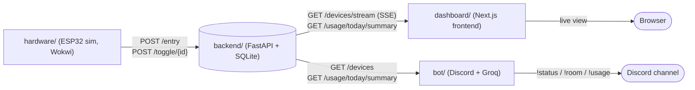
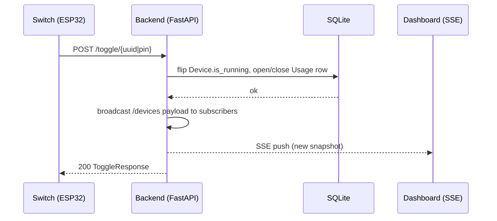

# POWER GRID — IoT Office Power Tracker

Real-time power monitoring for an office: a FastAPI backend tracks which devices are on, how much energy they've drawn, and what it costs — a Next.js dashboard and a Discord bot both read from it live, and a Wokwi-simulated ESP32 feeds it real device state.

```
hardware/  ──POST /entry, /toggle/{id}──▶   backend/   ◀── GET /devices, /usage/* ──   bot/ (Discord)
(ESP32 sim)                            (FastAPI + SQLite)
                                              ▲
                                              └── GET /devices/stream (SSE), /usage/today/summary ── dashboard/ (frontend/, Next.js)
```

The **backend is the single source of truth**. The dashboard, bot, and hardware simulation are all thin clients — none of them hold device state of their own.

## Architecture



### Toggle flow (device turns on/off)



The wiring diagram for the physical/simulated ESP32 layout lives at [`hardware/diagram.json`](hardware/diagram.json) (Wokwi format — open at [wokwi.com](https://wokwi.com/projects/468597680724521985) to view it visually).

## Repo layout

| Directory | Stack | Role |
|---|---|---|
| [`backend/`](backend/) | FastAPI + SQLModel + SQLite | Device registry, on/off session tracking, kWh/cost calc, SSE broadcast |
| [`frontend/`](frontend/) | Next.js 15 + TypeScript + Tailwind + Zustand | The dashboard — real-time device/room view |
| [`bot/`](bot/) | discord.py + Groq | `!status` / `!room` / `!usage` Discord commands |
| [`hardware/`](hardware/) | Wokwi ESP32 simulation (C++/.ino) | Simulates 5 switches/LEDs registering + toggling devices |

Each directory has its own README with full detail — this file covers getting the whole system running together.

## Prerequisites

- Python 3.10+
- Node.js 18+ and npm
- A [Groq API key](https://console.groq.com/keys) (free tier works) — only needed for the Discord bot
- A Discord bot token from the [Discord Developer Portal](https://discord.com/developers/applications) — only needed for the Discord bot
- (Optional, for the hardware simulation) A [Wokwi](https://wokwi.com/) account and a tunnel tool such as [Localtunnel](https://theboroer.github.io/localtunnel-www/) or ngrok

## Setup — run the whole stack

Start these in order; the backend must be up before the dashboard or bot will show real data.

### 1. Backend (`backend/`)

```bash
cd backend
python3 -m venv .venv
source .venv/bin/activate
pip install -r requirements.txt
python main.py
```

Runs on `http://localhost:8000`. Interactive API docs at `http://localhost:8000/docs`. A local `IOT.db` SQLite file is created automatically on first run — no migrations needed.

### 2. Dashboard (`frontend/`)

```bash
cd frontend
cp .env.local.example .env.local   # sets NEXT_PUBLIC_API_BASE=http://localhost:8000
npm install
npm run dev
```

Open `http://localhost:3000`. It reads `/devices/stream` (SSE) for live device state and `/usage/today/summary` for kWh/cost. Optionally drop a `floorplan.png` into `frontend/public/` for the background map image — without it the dashboard falls back to an SVG-only grid view.

### 3. Discord bot (`bot/`)

```bash
cd bot
python3 -m venv .venv
source .venv/bin/activate
pip install -r requirements.txt
cp .env.example .env
```

Fill in `bot/.env`:

```env
DISCORD_TOKEN=your_discord_bot_token_here
GROQ_API_KEY=your_groq_api_key_here
FASTAPI_URL=http://127.0.0.1:8000
```

```bash
python bot.py
```

Invite the bot to your server, then use `!status`, `!room <name>`, or `!usage` in any channel it can see.

### 4. Hardware simulation (`hardware/`, optional)

The ESP32 side is simulated in Wokwi rather than run locally:

1. Expose your local backend to the internet: `lt --port 8000` (or ngrok).
2. Open the [Wokwi project](https://wokwi.com/projects/468597680724521985), or import `hardware/diagram.json` + `hardware/sketch.ino` into a new one.
3. In `sketch.ino`, set `API_BASE_URL` to your tunnel URL (no trailing slash).
4. Add `ArduinoJson` in the Wokwi Library Manager (see `hardware/libraries.txt`).
5. Click ▶ Run. The simulation registers 5 devices (3 lights @15W, 2 fans @60W) via `POST /entry`, then toggles them via `POST /toggle/{uuid}` as you flip the switches.

## API summary (backend)

| Method & path | Purpose |
|---|---|
| `POST /entry` | Register a device, returns its generated UUID |
| `POST /toggle/{id\|pin}` | Flip a device on/off, opens/closes its usage session |
| `GET /devices` | Snapshot of all devices + live total wattage |
| `GET /devices/stream` | Same snapshot, pushed live over SSE on every change |
| `GET /usage/{id\|pin}` | Full on/off session history for one device |
| `GET /usage/today/summary` | kWh + cost aggregated since 00:00 UTC, per device and total |
| `GET /health` | Liveness check |

Full request/response schemas: `backend/schemas.py`, or `http://localhost:8000/docs` once running.

## Notes

- CORS on the backend is wide open (`allow_origins=["*"]`) for local development — restrict this before deploying anywhere shared.
- The backend's SSE broadcast is in-process, so it only works correctly with a single backend worker/process.
